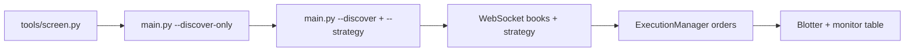

# Kalshi Prediction Market Trading Bot

Production-grade automated trading system for [Kalshi](https://kalshi.com) binary prediction markets. Supports five pluggable strategies (`kelly`, `green_up`, `high_prob`, `mean_reversion`, `arb`), **strategy-aligned market discovery** with live in-play filters, pre-trade **entry gates**, portfolio-synced **circuit breaker**, a live terminal monitor, manual order tools (`tools/trade.py`, `tools/orderbook.py`), offline replay, production PowerShell runners, and a persistent trade blotter (queryable by date, category, ticker, strategy, and resolution) with performance analytics and settlement reconciliation.

### Recent updates

- **Trade lifecycle & blotter P&L (2026-05-30/31)** — exit/stop fills **close the entry leg** with realised P&L (no phantom opposing legs); green_up hedged parents stay `hedged` until settlement (`mark_trade_hedged`); stop/exit fills finalize even when Kalshi reports contra-side labels (`side: "no"`). Same fill handling for `high_prob` and `mean_reversion`. Maintenance: `scripts/cleanup_stale_trades.py`.
- **Test/prod isolation** — `pytest` redirects logs and DB to a temp sandbox so the suite cannot append to `kalshi_bot_prod.jsonl` / `kalshi_bot_prod.db`.
- **Position alerts** — `AlertManager` skips stop/profit alerts on exchange positions the bot does not own (no CRITICAL noise on manual holdings).
- **Runtime live gates** — per-tick entry checks use WebSocket book/tape freshness; REST `updated_time` staleness applies at discovery only (fixes false “market not live” blocks on active in-play markets).
- **Demo / production profiles** — switch `KALSHI_ENV` only; per-env API keys, DB path, log file, and risk caps (`KALSHI_DEMO_*` / `KALSHI_PROD_*`)
- **Live market registry** — discovery and entries default to recently updated, soon-closing markets with fresh WebSocket books and recent tape
- **Strategy discovery presets** — `--discover` auto-applies filters/ranking matched to `--strategy` (overridable per flag)
- **Entry gates** — block new entries on low cash or markets too close to expiry (`risk/entry_gates.py`)
- **Concurrent position cap** — `--max-concurrent-positions` limits simultaneous entry legs (hedges/stops still run)
- **Green-up** — multi-ticker parallel watch, hedge modes (`full_green` / `stake_back` / `partial`), configurable entry/exit pricing, resting hedge/stop with safe reprice guards, max cycles per ticker
- **High-probability** — fee-adjusted ROI gating, post-fill take-profit / stop modes, fixed or Kelly-capped stake; exit fills hardened like green_up
- **Mean reversion** — rolling mid-price mean, buy dips / fade spikes (long YES or short via buy-NO), resting TP toward mean with stop; volatility floor for oscillating markets
- **Resilience** — WS liveness watchdog, REST book fallback + reconnect escalation, REST fill reconciliation (`KALSHI_FILL_RECONCILE_SECONDS`)
- **Prod scripts** — `scripts/run_green_up_prod.ps1`, `scripts/run_high_prob_prod.ps1`, `scripts/compare_prod_sessions.ps1` (isolated DB/logs for A/B)
- **Blotter queries** — filter trades/legs by strategy, category, date, resolution; export CSV
- **Roadmap** — certification plan and implementation status in [docs/ROADMAP.md](docs/ROADMAP.md)

## Requirements

- Python 3.11+
- A Kalshi account with API access enabled
- API key + RSA private key ([kalshi.com/account/api-keys](https://kalshi.com/account/api-keys))

---

## Setup

### 1. Install dependencies

```bash
pip install -r requirements.txt
```

### 2. Configure environment

```bash
cp .env.example .env
# Edit .env: KALSHI_DEMO_API_KEY_ID + KALSHI_DEMO_PRIVATE_KEY_B64 (demo)
# For production: KALSHI_PROD_* and KALSHI_ENV=production
```

Encode your private key:

```bash
# Linux / macOS
base64 -w 0 kalshi_private_key.pem

# Windows PowerShell
python -c "import base64, pathlib; print(base64.b64encode(pathlib.Path('kalshi_private_key.pem').read_bytes()).decode())"
[Convert]::ToBase64String([IO.File]::ReadAllBytes("kalshi_key.pem"))
```

The bot loads `.env` on startup. Shell exports override `.env` values.

**Demo vs production:** set both key pairs and risk profiles in `.env`, then switch with a single variable:

```env
KALSHI_ENV=demo          # paper — uses KALSHI_DEMO_* limits, demo DB/log
# KALSHI_ENV=production  # real money — uses KALSHI_PROD_* (default $1 max position)
```

Verify before trading: `python -c "import config; print(config.ENV, config.MAX_POSITION_CENTS, config.DB_PATH)"`

See [.env.example](.env.example) for `KALSHI_DEMO_*` / `KALSHI_PROD_*` blocks and [docs/ROADMAP.md](docs/ROADMAP.md) for the week-by-week certification plan.

### 3. Run tests

```bash
python -m pytest tests/ -v
```

---

## Discovering and trading by strategy

This is the main workflow: pick a **strategy**, optionally **discover** tickers in a Kalshi category, then run `main.py` with a live WebSocket feed and terminal monitor. The same `--strategy` flag drives both the trading engine and (by default) the discovery preset.

### End-to-end workflow



1. **Explore** — `python tools/screen.py categories` / `tags` / `series` / `sports-filters` / `browse` / `discover` / `screen` to map categories, tags, series, and strategy fit.
2. **Preview tickers** — `python main.py --discover ... --discover-only` (no orders).
3. **Trade** — same command without `--discover-only`; bot subscribes to all selected tickers and runs the strategy on each book update.
4. **Reconcile** — `tools/trade.py portfolio` for exchange truth; `tools/blotter.py` for bot-recorded cycles.

**Ticker sources** (first match wins):

| Source | How |
|--------|-----|
| `--tickers A,B,C` | Explicit list (overrides everything) |
| `--discover` / `KALSHI_DISCOVER=true` | Auto-select from `--discover-category` + optional tag/sport/series filters |
| `KALSHI_TICKERS` | Comma-separated env list |

Default category when discovering: **Trending** (override with `--discover-category Sports`, etc.).

### Strategy overview

| Strategy | CLI | Best for | Discovery preset | Typical markets |
|----------|-----|----------|------------------|-----------------|
| **Kelly** | `--strategy kelly` | Model edge vs market | `kelly` — liquid, tight spread | Any category where you supply `P(YES)` |
| **Green Up** | `--strategy green_up` | In-play underdog → hedge | `green_up` — cheap YES, active, closing soon | Live Sports / fast-moving lines |
| **High probability** | `--strategy high_prob` | High implied win rate, fee-aware ROI | `high_prob` — YES 85–97¢, rank by net ROI | Politics, macro, “likely” outcomes |
| **Mean reversion** | `--strategy mean_reversion` | Fade swings around rolling mean | `mean_reversion` — mid-range YES, high vol, screener | Volatile Sports / in-play oscillators |
| **Arbitrage** | `--strategy arb` | Structural mispricing | `arb` — top volume, full category scan | Paired / related contracts |

All strategies share:

- **WebSocket-driven signals** — entries evaluated on `orderbook_delta` ticks (not REST monitor prices alone).
- **Execution pricing** — `strategy/execution_price.py` maps `passive`, `cross_spread`, `market`, `limit_offset`, etc. to limit/IOC orders.
- **Risk** — circuit breaker (drawdown, daily loss, open-position caps), optional `--max-concurrent-positions`, and [entry gates](#entry-gates-and-concurrency) before new entries.
- **Blotter** — parent trades + legs for anything opened through `main.py`.

---

### Discovery presets (auto-applied with `--discover`)

When `--discover` is set, `discovery/discovery_presets.py` overlays defaults for `--strategy` unless you pass the same field explicitly on the CLI (those flags are never overwritten).

| Preset | Strategy | Default filters | Ranking |
|--------|----------|-----------------|--------|
| `high_prob` | `high_prob` | YES ask 85–97¢, spread ≤8¢, min vol 200 | **fee_adjusted_roi** |
| `green_up` | `green_up` | YES ask ≤35¢, min vol 500, updated ≤2h, close ≤6h | **screener** (green_up fit) |
| `mean_reversion` | `mean_reversion` | YES ask 15–85¢, min vol 500, updated ≤4h, close ≤8h | **screener** (mean_rev fit) |
| `kelly` | `kelly` | Spread ≤10¢, min vol 100 | **volume** |
| `arb` | `arb` | Top 25, min vol 50, full category scan | **volume** |

**Screener floor:** markets below **200** contracts 24h volume are dropped in `discovery/screener.py` regardless of preset. Presets can require more (e.g. green_up min 500).

```bash
# Force a preset different from --strategy
python main.py --discover --discover-preset high_prob --strategy green_up --discover-only

# Raw filters only (no preset overlay)
python main.py --discover --discover-preset none --discover-category Sports \
  --discover-max-yes-ask 30 --discover-rank-by volume --discover-only
```

**Discovery CLI flags:** `--discover-top`, `--discover-min-volume`, `--discover-min-yes-ask`, `--discover-max-yes-ask`, `--discover-max-spread`, `--discover-activity-hours`, `--discover-max-minutes-to-close`, `--discover-rank-by` (`volume`, `fee_adjusted_roi`, `screener`, `activity`, `spread`), `--discover-min-fee-roi`, `--discover-full-scan`, `--discover-only`, `--discover-preset`, `--discover-no-tradeable-filter`, `--no-live-only`, plus drill-down: `--discover-tag`, `--discover-sport`, `--discover-competition`, `--discover-scope`, `--discover-series`.

**Discovery environment variables:** `KALSHI_DISCOVER`, `KALSHI_DISCOVER_CATEGORY`, `KALSHI_DISCOVER_TOP`, `KALSHI_DISCOVER_MIN_YES_ASK`, `KALSHI_DISCOVER_MAX_YES_ASK`, `KALSHI_DISCOVER_MAX_SPREAD`, `KALSHI_DISCOVER_MIN_VOLUME`, `KALSHI_DISCOVER_ACTIVITY_HOURS`, `KALSHI_DISCOVER_RANK_BY`, `KALSHI_DISCOVER_MAX_MINUTES_TO_CLOSE`, `KALSHI_DISCOVER_TAG`, `KALSHI_DISCOVER_SPORT`, `KALSHI_DISCOVER_COMPETITION`, `KALSHI_DISCOVER_SCOPE`, `KALSHI_DISCOVER_SERIES`, `KALSHI_MAX_CONCURRENT_POSITIONS`.

`--discover-only` prints a table with **vol24h**, **ask**, **fee ROI**, **spread**, **minutes since update**, **series**, ticker, and title. Use `--discover-rank-by activity` for live/in-play candidates (most recently updated first).

---

### Sports and tag drill-down

Kalshi exposes category tags and sports filters via the [tags-by-categories](https://docs.kalshi.com/api-reference/search/get-tags-for-series-categories) and [filters-by-sport](https://docs.kalshi.com/api-reference/search/get-filters-for-sports) search endpoints. The bot uses these to narrow discovery from **Sports** → **Basketball** → **Games** → **series** → **tickers**.

**Explore (no bot run):**

```bash
# Tags under a category (Basketball, Tennis, …)
python tools/screen.py tags --category Sports

# Leagues and scopes for one sport
python tools/screen.py sports-filters --sport Basketball

# Series titles/tickers for a tag (e.g. Pro Basketball Finals Matchup)
python tools/screen.py series --category Sports --tag Basketball

# All open markets in a drill-down (volume-sorted browse table)
python tools/screen.py browse --category Sports --sport Basketball --scope Games --activity-hours 2 --full-scan

# Markets in one series
python tools/screen.py browse --category Sports --series YOUR-SERIES-TICKER

# Strategy-aligned top N (same presets as main.py --discover)
python tools/screen.py discover --category Sports --sport Basketball --scope Games --strategy high_prob --top 15
```

**Discover with `main.py` (preview or trade):**

```bash
# Live Basketball game markets, high_prob preset, rank by recency
python main.py --discover --discover-category Sports --discover-tag Basketball \
  --discover-scope Games --strategy high_prob --discover-only \
  --discover-rank-by activity --discover-top 20

# All markets in one series
python main.py --discover --discover-category Sports --discover-series YOUR-SERIES-TICKER \
  --strategy high_prob --discover-only

# NBA competition filter (from sports-filters)
python main.py --discover --discover-category Sports --discover-sport Basketball \
  --discover-competition NBA --discover-scope Games --strategy green_up --discover-only
```

Setting any drill-down flag enables a **full category scan** automatically so high-volume markets are not missed. **Trending** discovery ignores tag/sport filters (cross-category volume scan only).

---

### Live market filters (default on)

Discovery and entries target **in-play** markets unless you disable live mode.

| Gate | Default | Applies to |
|------|---------|------------|
| Recently updated on Kalshi | ≤ **2 h** (`KALSHI_LIVE_MAX_MINUTES_SINCE_UPDATE`) | Discovery |
| Closing soon | ≤ **6 h** (`KALSHI_LIVE_MAX_MINUTES_TO_CLOSE`) | Discovery + entry |
| Fresh WebSocket book | ≤ **30 min** (`KALSHI_LIVE_MAX_BOOK_STALE_MINUTES`) | Entry |
| Recent trade on tape | ≤ **2 h** (`KALSHI_LIVE_MAX_TRADE_STALE_MINUTES`) | Entry |

Master switch: `KALSHI_LIVE_ONLY=true` (default). Disable with `--no-live-only` or `KALSHI_LIVE_ONLY=false` for debugging.

```bash
# Tighter Sports window: updated in 30m, closes within 3h
python main.py --discover --discover-category Sports --strategy green_up \
  --discover-activity-hours 0.5 --discover-max-minutes-to-close 180 --discover-only
```

Implementation: `discovery/live_market.py`, `discovery/market_registry.py`.

---

### Entry gates and concurrency

Before any **new entry** (`entry` / `leg_1` phase), `risk/entry_gates.py` can block the order:

| Gate | Config | Effect |
|------|--------|--------|
| Low balance | `KALSHI_MIN_BALANCE_CENTS`, `KALSHI_BLOCK_LOW_BALANCE` | Skip entry if cash below minimum |
| Too close to expiry | `KALSHI_MIN_MINUTES_TO_EXPIRY` | Skip if market closes sooner than N minutes |

**Concurrent positions:** `--max-concurrent-positions N` (or `KALSHI_MAX_CONCURRENT_POSITIONS`) counts open/pending **entry** legs via `strategy/position_limits.py`. At the cap, new entries are skipped; **hedges, stops, and exits still run**. `0` = unlimited.

---

### Kelly (`--strategy kelly`)

Uses **your** estimate of P(YES) vs the market-implied probability from the YES ask. Trades only when edge / half-spread ≥ `MIN_EDGE_TO_VIG` (default 2%). Position size = fractional Kelly (`KELLY_DIVISOR`, default quarter-Kelly) capped by `MAX_POSITION_CENTS`.

**Required:** model probabilities per ticker.

```bash
# Manual tickers + explicit probabilities
python main.py --strategy kelly \
  --tickers TICKER-A,TICKER-B \
  --model-prob TICKER-A:0.62 TICKER-B:0.55

# Discover liquid markets, then trade (you still must pass --model-prob)
python main.py --discover --discover-category Politics --strategy kelly \
  --discover-top 10 --model-prob TICKER-A:0.58
```

Env: `KALSHI_MODEL_PROB=TICKER:0.62,TICKER2:0.55`, `KALSHI_STRATEGY=kelly`.

Kelly does not hedge automatically — one-shot YES/NO entries based on edge. Use the screener’s Kelly column in `tools/screen.py` to find candidates.

---

### Green Up (`--strategy green_up`)

**Idea:** buy cheap **YES** on an underdog (low implied probability), then **buy NO** when the line moves in your favor to lock profit or cap loss. Designed for **multiple tickers in parallel** (e.g. several live games).

**State machine per ticker:** `WATCHING` → `ENTERED` → `HEDGING` → `HEDGED`, or `ENTERED` → `STOPPING` → `STOPPED`.

#### Entry and hedge parameters

| Flag | Default | Description |
|------|---------|-------------|
| `--entry-max` | 25¢ | Max YES **ask** to enter (optional underdog filter) |
| `--gu-no-entry-max` | off | Disable entry cap — enter at current book prices |
| `--hedge-trigger` | 68¢ | **Absolute** mode: hedge when YES **bid** ≥ this |
| `--hedge-offset` | — | **Relative** mode: hedge when YES bid ≥ entry + N¢ (overrides `--hedge-trigger`) |
| `--gu-hedge-style` | `trigger` | `trigger` = wait for bid; `resting` = GTC buy-NO at trigger right after entry fill |
| `--hedge-mode` | `full_green` | `full_green` \| `stake_back` \| `partial` |
| `--stop-loss` | 10 | Stop when YES bid falls **N cents** below entry (max loss ≈ N¢/contract) |
| `--gu-max-spread` | 8 | Skip entry when YES spread exceeds N¢ |
| `--gu-entry-mode` | `passive` | Pricing for **buy YES** entries |
| `--gu-exit-mode` | `passive` | Pricing for **buy NO** on trigger-style hedges and stop legs |
| `--gu-limit-offset` | 0 | With `limit_offset`: cents from bid (e.g. `-2`) |
| `--gu-max-cycles` | 0 | Max completed entry→exit cycles per ticker (`0` = unlimited) |
| `--max-concurrent-positions` | 0 | Cap simultaneous entry legs (`0` = unlimited) |

**Hedge trigger modes:**

| Mode | Flag | Behavior |
|------|------|----------|
| Absolute | `--hedge-trigger 68` | Same YES bid threshold every cycle (session-wide) |
| Relative | `--hedge-offset 26` | Per fill: hedge at entry + 26¢ (adapts each cycle) |

**Hedge execution styles** (`--gu-hedge-style`):

| Style | Behavior |
|-------|----------|
| `trigger` (default) | Wait until YES bid ≥ hedge level, then buy NO using `--gu-exit-mode` |
| `resting` | Immediately after entry fill, post **GTC buy-NO** at `100 − hedge_trigger` (fills when YES rises to trigger). Stop-loss cancels the resting hedge. |

**Hedge sizing modes:**

| Mode | Outcome |
|------|---------|
| `full_green` | Equal profit whether YES or NO wins (classic “green up”) |
| `stake_back` | Hedge sized to recover stake; more upside if original YES wins |
| `partial` | Scaled hedge between full green and stake back |

**Sizing:** fractional Kelly from entry vs expected hedge-trigger odds, capped by `MAX_POSITION_CENTS`. Contracts ≈ `size_cents // entry_price`. Entry also requires positive locked-profit preview at the hedge target and spread ≤ `--gu-max-spread`.

**Order pricing** (`--gu-entry-mode` / `--gu-exit-mode`):

| Mode | Buy | Sell |
|------|-----|------|
| `passive` | Limit at **bid** (resting) | Limit at **ask** (resting) |
| `cross_spread` | Limit at **ask** (IOC) | Limit at **bid** (IOC) |
| `market` | IOC market | IOC market |
| `limit_at_bid` / `limit_at_ask` / `limit_at_mid` / `limit_offset` | Explicit prices | Same |

**Recommended flows:**

```bash
# 1) Preview — screener-ranked underdogs, no orders
python main.py --discover --discover-category Sports --strategy green_up \
  --discover-top 5 --discover-only

# 2) Classic — absolute trigger, market entry, cross-spread hedge
python main.py --discover --discover-category Sports --strategy green_up \
  --discover-top 5 --max-concurrent-positions 5 \
  --entry-max 25 --hedge-trigger 68 --hedge-mode full_green \
  --gu-entry-mode market --gu-exit-mode cross_spread \
  --monitor-interval 30

# 3) Dynamic — relative hedge, no entry cap, resting GTC hedge after fill
python main.py --tickers YOUR-TICKER --strategy green_up \
  --gu-no-entry-max --hedge-offset 26 --gu-hedge-style resting \
  --gu-entry-mode passive --gu-max-spread 8 --stop-loss 10 \
  --hedge-mode partial --max-concurrent-positions 5 --monitor-interval 30

# 4) Replay recorded session with same params
python tools/replay.py replay --input recordings/game.jsonl --strategy green_up \
  --hedge-offset 26 --gu-hedge-style resting --gu-no-entry-max

# 5) Production micro-pilot — see scripts/run_green_up_prod.ps1
.\scripts\run_green_up_prod.ps1 -DiscoverOnly
```

Env block: [Green-up environment variables](#green-up-environment-variables) below.

**Flattening:** green-up often holds **YES and NO** on the same ticker. `main.py` does not auto-flatten on exit — use `tools/trade.py close` / `sell` per leg.

---

### High probability (`--strategy high_prob`)

**Idea:** buy **YES** when the market already implies a high win probability (default ask **85–97¢**), accepting a smaller payout per contract. Entries must pass **fee-adjusted ROI** when `HP_USE_FEE_ADJUSTED_ROI=true` (default).

Entry gates (min/max band, ROI, spread) apply to the **limit price** you will actually trade (`--hp-entry-mode`), not the raw ask — so passive entries at the bid are validated correctly.

| Flag | Default | Description |
|------|---------|-------------|
| `--hp-min-yes-ask` / `--hp-max-yes-ask` | 85 / 97 | Entry window on **limit price** (cents) |
| `--hp-stake-cents` | min(5000, cap) | Fixed stake per entry |
| `--hp-entry-mode` / `--hp-exit-mode` | `passive` | Limit/market pricing |
| `--hp-post-fill` | `hold` | After fill: hold, TP, stop, or both |
| `--hp-take-profit-pct` | — | TP as fraction of (entry + vig), e.g. `0.30` |
| `--hp-take-profit-offset` | 3 | TP at entry + N¢ when pct not set |
| `--hp-tp-style` | `fixed` | `fixed` = entry-based TP; `at_ask` = max(TP, ask) |
| `--hp-stop-loss` | 0.12 | Stop fraction below entry (ignored if cents set) |
| `--hp-stop-loss-cents` | — | Stop N¢ below entry (overrides fraction) |
| `--hp-max-spread` | 8 | Skip entry when spread exceeds N¢ |
| `--hp-max-cycles` | 0 | Max completed entry→exit cycles per ticker (`0` = unlimited) |

**Take-profit / stop (per fill):** computed on entry fill from actual fill price — offset, pct×(entry+vig), or cent stop via shared `price_targets`. Stop-loss while a resting TP is on book **cancels the TP order** before submitting the stop sell.

**Re-entry:** after an exit fill the ticker returns to `scanning` and may enter again when the book qualifies, up to `--hp-max-cycles` (same pattern as green_up).

**Entry / exit modes:**

| Mode | Buy YES | Sell YES |
|------|---------|----------|
| `passive` | Limit at bid (GTC) | Limit at ask (GTC) |
| `cross_spread` | Limit at ask (IOC) | Limit at bid (IOC) |
| `market` | IOC market | IOC market |
| `limit_at_mid` / `limit_offset` | Mid or bid±offset | Mid or ask∓offset |

Stop-loss exits use `cross_spread` when exit mode is `passive`, so stops cross the book.

**Post-fill** (`--hp-post-fill`):

| Mode | Behaviour |
|------|-----------|
| `hold` | Hold to settlement |
| `resting_take_profit` | Resting sell YES at entry + offset or pct×(entry+vig) |
| `resting_stop` | IOC sell if bid breaches stop |
| `tp_and_stop` | Resting TP plus stop on breach |

**Examples:**

```bash
# Preview Politics high-ROI candidates
python main.py --discover --discover-category Politics --strategy high_prob --discover-only

# Passive entry with cent stop and fixed resting TP
python main.py --discover --discover-category Sports --strategy high_prob \
  --hp-entry-mode passive --hp-post-fill resting_take_profit \
  --hp-take-profit-offset 3 --hp-stop-loss-cents 10 --hp-max-spread 8 \
  --max-concurrent-positions 2 --monitor-interval 30

# Percent take-profit (legacy at_ask TP style available via --hp-tp-style at_ask)
python main.py --discover --discover-category Sports --strategy high_prob \
  --hp-entry-mode limit_at_bid --hp-post-fill resting_take_profit \
  --hp-take-profit-pct 0.25 --max-concurrent-positions 2 --monitor-interval 30
```

Production script: `scripts/run_high_prob_prod.ps1` (fixed $1 stake, isolated prod DB/log).

---

### Mean reversion (`--strategy mean_reversion`)

**Idea:** track a **rolling mid-price mean** per ticker and fade short-term deviations — buy YES when price dips below the mean, or buy NO when price spikes above it (short YES exposure). Best suited to **volatile, oscillating** markets; a minimum rolling volatility filter skips flat books.

| Flag | Default | Description |
|------|---------|-------------|
| `--mr-lookback` | 20 | Rolling window size (ticks) |
| `--mr-min-samples` | 10 | Minimum ticks before entries |
| `--mr-entry-deviation` | 5 | Enter when mid deviates N¢ from mean |
| `--mr-min-volatility` | 4.0 | Min rolling std dev (¢) to trade |
| `--mr-entry-max` / `--mr-entry-min` | 45 / 10 | Long entry YES ask band (green_up-style cap) |
| `--mr-short-min-yes-ask` / `--mr-short-max-yes-ask` | 55 / 90 | Short (fade) YES ask band |
| `--mr-stake-cents` | min(5000, cap) | Fixed stake per entry |
| `--mr-trade-direction` | `both` | `long`, `short`, or `both` |
| `--mr-exit-target` | `max` | TP at `mean`, `offset`, or max of both |
| `--mr-take-profit-offset` | 5 | Minimum TP offset from entry (¢) |
| `--mr-stop-loss-cents` | 10 | Stop if move continues against entry |
| `--mr-entry-mode` / `--mr-exit-mode` | `passive` | Limit/market pricing |
| `--mr-post-fill` | `tp_and_stop` | `hold`, resting TP, stop, or both |
| `--mr-max-spread` | 8 | Skip entry when spread exceeds N¢ |
| `--mr-max-cycles` | 0 | Max completed round-trips per ticker |

**Long leg:** buy YES on dip → resting sell YES at mean reversion target. **Short leg:** buy NO on spike → resting sell NO when YES reverts. Exit wiring matches `high_prob` (TP/stop registration, blotter close on round-trip).

**Examples:**

```bash
# Preview volatile mid-range Sports markets
python main.py --discover --discover-category Sports --strategy mean_reversion --discover-only

# Long-only dips, passive entry, TP + stop
python main.py --discover --discover-category Sports --strategy mean_reversion \
  --mr-trade-direction long --mr-entry-deviation 6 \
  --mr-post-fill tp_and_stop --max-concurrent-positions 2 --monitor-interval 30

# Fade spikes only (buy NO on rally)
python main.py --discover --discover-category Sports --strategy mean_reversion \
  --mr-trade-direction short --mr-entry-deviation 5 --mr-stop-loss-cents 12
```

Env vars: `KALSHI_MR_*` (see `config.py` and `.env.example`).

---

### Arbitrage (`--strategy arb`)

Scans for **complementary pairs**, exhaustive sets, and dominance relationships. Register pairs with `--comp-pairs TICKER_A:TICKER_B` or `KALSHI_ARB_PAIRS`.

```bash
python main.py --discover --discover-category Sports --strategy arb \
  --discover-full-scan --comp-pairs MARKET-A:MARKET-B
```

Discovery preset pulls **top 25 by volume** with `--discover-full-scan` for broader coverage. Arb is the most category-scan intensive mode — watch rate limits (`429` backoff is automatic).

---

### Order pricing reference (green_up, high_prob, mean_reversion)

Shared modes from `strategy/execution_price.py` (YES buy/sell/exit and NO buy/sell/exit):

| Mode | Typical use |
|------|-------------|
| `passive` | Maker-style limits at bid (buy) / ask (sell) |
| `cross_spread` | Taker-style IOC limits at ask (buy) / bid (sell) |
| `market` | IOC market orders |
| `limit_offset` | Bid + N cents (e.g. prod script uses `-2` for bid−2¢) |

---

### Production run scripts (PowerShell)

For **real-money micro-pilots**, use the bundled scripts so each strategy writes to its **own** DB and JSONL log (easy A/B comparison):

| Script | Strategy | Notes |
|--------|----------|-------|
| `scripts/run_green_up_prod.ps1` | `green_up` | Tunables at top of file; prompts for prod confirmation |
| `scripts/run_high_prob_prod.ps1` | `high_prob` | Fixed stake, Sports discovery defaults |
| `scripts/compare_prod_sessions.ps1` | — | Compare P&L across isolated session logs |

```powershell
.\scripts\run_high_prob_prod.ps1 -DiscoverOnly
.\scripts\run_green_up_prod.ps1 -DiscoverOnly
.\scripts\compare_prod_sessions.ps1
```

Requires `KALSHI_ENV=production` and prod keys in `.env`. Edit stake/discovery tunables inside each script before going live.

---

### Inspect a market before trading

```bash
python tools/orderbook.py --ticker SOME-TICKER
python tools/orderbook.py --ticker SOME-TICKER --depth 20 --json
python tools/screen.py browse --ticker SOME-TICKER
```

---

## Manual trading (`tools/trade.py`)

The bot does **not** auto-flatten on shutdown. Use `tools/trade.py` to inspect the exchange portfolio and close legs manually. Orders placed only here are **not** written to the bot blotter (see [Trade history](#trade-history-and-blotter)).

### Portfolio and orders

```bash
python tools/trade.py portfolio      # open positions + mark-to-market P&L
python tools/trade.py positions      # alias for portfolio
python tools/trade.py position --ticker TICKER
python tools/trade.py balance
python tools/trade.py orders         # resting orders
python tools/trade.py cancel --order-id ORDER_ID
python tools/trade.py cancel-all --yes   # --yes = skip confirmation
```

### Buy, sell, and close

```bash
# Preview (shows BUY vs SELL in the header)
python tools/trade.py preview --ticker TICKER --side yes --count 10 --price 32
python tools/trade.py preview --ticker TICKER --side yes --count 150 --market

# Buy
python tools/trade.py buy --ticker TICKER --side yes --count 10 --price 32
python tools/trade.py buy --ticker TICKER --side yes --count 10 --market

# Sell (reduce / close a long you already hold)
python tools/trade.py sell --ticker TICKER --side yes --count 150 --market
python tools/trade.py sell --ticker TICKER --side yes --count 150 --market --yes   # skip confirm

# Close entire position on one ticker (reads size from portfolio)
python tools/trade.py close --ticker KXNBASPREAD-26MAY17CLEDET-CLE12
python tools/trade.py close --ticker TICKER --count 50    # partial
```

**Market order pricing on Kalshi:** every order includes `yes_price` or `no_price`, even when `type=market`:

| Action | `yes_price` meaning |
|--------|---------------------|
| **Buy** YES | Maximum you will pay (walks the **ask** ladder) |
| **Sell** YES | Minimum you will accept (walks the **bid** ladder) |

`tools/trade.py` sets these from the live book via `market_order_yes_price()` in `discovery/orderbook_parse.py`. A sell preview with bid 8¢ / ask 10¢ should show **SELL MARKET YES** and **YES price: 8c**, not 10c.

**IOC + `status=cancelled`:** market orders use immediate-or-cancel. `cancelled` with zero fills means nothing matched (e.g. sell floor above the best bid, no position to sell, or thin demo liquidity)—not an API rejection. Check `python tools/trade.py portfolio` before selling.

Green-up **hedges** are separate **NO** legs. To flatten fully you may need to close both YES and NO if both are open (`close` defaults to the side you hold; use `sell --side no` for NO).

---

## Quick start (paper trading)

See [Discovering and trading by strategy](#discovering-and-trading-by-strategy) for the full workflow. Minimal path:

### 1. Screen markets

```bash
python tools/screen.py categories
python tools/screen.py tags --category Sports
python tools/screen.py series --category Sports --tag Basketball
python tools/screen.py browse --category Politics
python tools/screen.py browse --category Sports --sport Basketball --scope Games
python tools/screen.py screen --category Politics
python tools/screen.py browse --ticker SOME-TICKER
```

The screener scores each market for Kelly, Green Up, **high_prob**, **mean_reversion**, and arbitrage fit. For Sports, use `tags` → `sports-filters` → `series` before `browse` or `discover` (see [Sports and tag drill-down](#sports-and-tag-drill-down)).

### 2. Preview discovery, then run (demo)

```bash
# Preview tickers for your strategy (no orders)
python main.py --discover --discover-category Sports --strategy green_up --discover-only

# Trade — same flags without --discover-only
python main.py --discover --discover-category Sports --strategy green_up \
  --discover-top 5 --max-concurrent-positions 5 --monitor-interval 30

# High-probability example
python main.py --discover --discover-category Politics --strategy high_prob \
  --hp-entry-mode limit_at_bid --hp-post-fill resting_take_profit

# Mean reversion — volatile mid-range markets
python main.py --discover --discover-category Sports --strategy mean_reversion \
  --mr-trade-direction both --mr-post-fill tp_and_stop

# Kelly — requires model probabilities
python main.py --strategy kelly --tickers TICKER-A --model-prob TICKER-A:0.62
```

Defaults to **demo** (`KALSHI_ENV=demo`). Real money only when `KALSHI_ENV=production` (prefer `scripts/run_*_prod.ps1` for isolated logs).

### 3. Manual orders and portfolio

```bash
python tools/trade.py portfolio
python tools/trade.py preview --ticker TICKER-A --side yes --count 10 --price 32
python tools/trade.py buy --ticker TICKER-A --side yes --count 10 --price 32
python tools/trade.py sell --ticker TICKER-A --side yes --count 10 --market
python tools/trade.py close --ticker TICKER-A
python tools/trade.py monitor --interval 15
```

See [Manual trading](#manual-trading-toolstradepy) for the full command list.

### 4. Live monitor table

While `main.py` runs, a full-screen table shows cash, P&L, per-ticker bid/ask, strategy state (watching → entered → hedged), and alerts. Refresh interval defaults to `KALSHI_MONITOR_INTERVAL` (15s); override with `--monitor-interval` (use `0` to disable).

```bash
python main.py --strategy green_up --tickers TICKER-A --entry-max 10 --hedge-trigger 13 --monitor-interval 5

python main.py --strategy high_prob --tickers TICKER-A --monitor-interval 15
```

The monitor falls back to REST order books when the WebSocket book is **empty or stale** (default: no WS update for 60s, `KALSHI_WS_BOOK_REST_FALLBACK_SECONDS`). A background poll also REST-refreshes stale books and re-runs `strategy.evaluate()` so hedge/stop logic is not blocked by a frozen WS feed. With live filters enabled, stale WS books still block **new entries** even if REST shows fresher prices.

**Fill rate in the monitor** counts signals where the bot’s fill listener saw an exchange fill—not every resting limit or IOC that was sent. Use `tools/trade.py orders` / `portfolio` to reconcile exchange state.

### 5. Dashboard and session reports

```bash
python tools/dashboard.py --interval 15 --calibration
python tools/session_report.py
python tools/session_report.py --date 2026-05-17 --json reports/session.json
python tools/blotter_report.py performance --days 7
python tools/blotter_report.py calibration --days 30
```

---

## Trade history and blotter

Every trade opened through **`main.py`** is recorded in a SQLite database (default `kalshi_bot.db`, path via `KALSHI_DB_PATH`). Two tables:

| Table | Contents |
|-------|----------|
| `parent_trades` | One row per logical trade — status `open` → `hedged` (both legs filled, awaiting settlement) → `closed` / `settled`; net P&L rolled up when legs close |
| `trades` | One row per **leg** (entry, hedge, stop) — side, prices, fees, `trade_type` |

**Lifecycle accounting (bot-driven orders):**

| Event | Blotter behavior |
|-------|------------------|
| Entry fill | Opens parent + `entry` leg |
| Hedge fill (green_up) | Records `hedge` leg; parent → **`hedged`** (legs stay open until market resolves) |
| Exit / stop fill | **`close_leg`** on the open entry leg at fill price (realised P&L); parent → **`closed`** when strategy completes |
| Settlement | `SettlementWatcher` closes remaining open legs; parent → **`settled`** |

Stale or pre-fix rows (phantom second legs, parents stuck `open` after stop) can be reconciled with `python scripts/cleanup_stale_trades.py` (dry-run by default; `--apply` to persist).

The same database also holds **metrics** tables (`signals`, `metrics_fills`, `equity_snapshots`) for fill rate, Sharpe, and drawdown. Structured JSON logs go to `kalshi_bot.jsonl` (`KALSHI_LOG_FILE`).

**Not recorded automatically:** orders placed only via `tools/trade.py` (manual CLI) or directly on the Kalshi website — those live on the exchange, not in the bot blotter unless you add them manually.

### Query CLI (`tools/blotter.py`)

| Command | Purpose |
|---------|---------|
| `trades` | List parent trades (filterable) |
| `search` | Same filters as `trades`; add `--legs` for fill-level rows |
| `legs` | Individual fills (entry / hedge / stop) |
| `detail` | Full parent trade + all legs (`--trade-id T-NNNN`) |
| `open` | Open positions still in the blotter |
| `pnl-by-strategy` / `pnl-by-category` | Aggregated P&L |
| `best` / `worst` | Top N trades by net P&L |
| `note` | Annotate a trade or leg |
| `settle` | Manually mark settled (`--resolution yes\|no\|void`) |

**Filters** (combinable on `trades`, `search`, and `legs` where applicable):

| Filter | Flag | Example |
|--------|------|---------|
| Status | `--status` | `open`, `hedged`, `closed`, `settled` |
| Category | `--category` | `Sports`, `Politics` |
| Strategy | `--strategy` | `green_up` (substring match) |
| Ticker | `--ticker` | exact market ticker |
| Trade ID | `--trade-id` | `T-0042` |
| Resolution | `--resolution` | `yes`, `no`, `void` |
| Date range | `--days N` or `--from` / `--to` | last 7 days; `2026-05-01` … `2026-05-17` |
| Leg type | `--trade-type` | `entry`, `hedge`, `stop_loss` (with `search --legs` or `legs`) |
| Export | `--csv FILE` | write results to CSV |
| Limit | `--limit` | default 200 trades / 500 legs |

```bash
# Parent trades
python tools/blotter.py trades --days 7
python tools/blotter.py trades --category Sports --strategy green_up --status closed
python tools/blotter.py search --resolution yes --status settled --days 30
python tools/blotter.py search --trade-id T-0042
python tools/blotter.py detail --trade-id T-0042

# Leg-level (entry / hedge / stop)
python tools/blotter.py search --legs --ticker TICKER-A --days 14
python tools/blotter.py search --legs --trade-type hedge --days 30
python tools/blotter.py legs --trade-id T-0042

# Aggregates and export
python tools/blotter.py pnl-by-strategy --days 30
python tools/blotter.py pnl-by-category --days 30 --csv category_pnl.csv
python tools/blotter.py trades --status closed --days 30 --csv trades.csv
```

On shutdown, `main.py` prints a short summary of closed/settled trades from the last 24 hours.

---

## Offline replay

```bash
# Record live book data
python tools/replay.py record --tickers TICKER-A --output data/session.jsonl --duration 1800

# Replay strategies
python tools/replay.py replay --input data/session.jsonl --strategy kelly \
  --model-prob TICKER-A:0.62 --speed 100

python tools/replay.py replay --input data/session.jsonl --strategy green_up \
  --entry-max 30 --hedge-trigger 70

python tools/replay.py replay --input data/session.jsonl --strategy high_prob

python tools/replay.py replay --input data/session.jsonl --strategy mean_reversion \
  --mr-trade-direction long --mr-entry-deviation 5
```

---

## Troubleshooting

Common issues when running the bot or `tools/trade.py`. Check structured logs in `kalshi_bot.jsonl` (`KALSHI_LOG_FILE`) for `ORDER_SENT`, `SYSTEM`, and strategy events.

### Market order shows `status=cancelled`

**Symptom:** `tools/trade.py` prints “Order placed successfully” but `status=cancelled` and position size unchanged.

**Cause:** Kalshi market orders use **immediate-or-cancel (IOC)**. `cancelled` usually means **zero contracts filled**, not an API error.

| Check | What to do |
|-------|------------|
| Sell floor above bid | Sell preview must show **SELL** and `yes_price` at the **bid** (e.g. 8¢), not the ask (10¢). Update to latest code; see [Manual trading](#manual-trading-toolstradepy). |
| No position | `python tools/trade.py portfolio` — you can only sell what you hold. Wrong side? Use `--side no` or `close` (auto-detects side). |
| Thin demo book | Large `--count` may not fully fill; try a smaller size or `cross_spread` limit at the bid. |
| Resting limits | Use `python tools/trade.py orders` and `cancel-all` if old GTC orders block intent. |

### Bot runs but never enters (stuck in `watching` / `scanning`)

**Symptom:** Monitor shows tickers and prices; strategy state stays `watching` or `scanning`; few or no `ORDER_SENT` lines.

| Check | What to do |
|-------|------------|
| Live gates | Default requires fresh WS book (≤30 min) and recent tape (≤2 h). Runtime entry uses WS freshness only — REST `updated_time` is a **discovery** filter, not re-checked every tick. Wait for WS snapshots or temporarily `--no-live-only` to test. |
| Entry price | Green-up only buys when YES **ask** ≤ `--entry-max` (default 25¢). Prices above that are expected skips. |
| WebSocket | Strategy entries need WS ticks, not REST-only monitor prices. Confirm ingestor connected (no repeated WS errors in logs). |
| Concurrent cap | `--max-concurrent-positions N` blocks **new entries** when N legs are open; hedges/stops still fire. |
| Passive mode | `--gu-entry-mode passive` rests at the bid; may not fill in fast markets. Try `cross_spread` or `market`. |

### Fill rate `0%` in the monitor

**Symptom:** Session table shows `Fill rate: 0% (0/N)`.

**Cause:** That metric counts signals where the bot’s **fill listener** confirmed an exchange fill—not every order submitted.

| Check | What to do |
|-------|------------|
| Resting orders | Passive limits may be open but unfilled; check `tools/trade.py orders`. |
| IOC / market | Entries can be sent and cancelled with 0 fill; see cancelled-market section above. |
| Ground truth | Use `tools/trade.py portfolio` and Kalshi’s UI for actual positions. |

### Discovery picks “dead” or far-dated markets

**Symptom:** Tickers look like old game lines; no tape activity; entries never pass live gates.

**Cause:** Older builds used a 48h activity window; current **green_up** preset uses **2h** update + **6h** close.

**Fix:** Restart with current code; keep `KALSHI_LIVE_ONLY=true` (default). Tighten with `--discover-activity-hours 0.5 --discover-max-minutes-to-close 180`. Preview only: `--discover-only`.

### Monitor shows prices; strategy does not react

**Symptom:** Terminal table updates bid/ask via REST fallback; no state changes.

**Cause:** The **monitor** can use REST when the WS book is empty; the **strategy** evaluates on WebSocket `orderbook_delta` ticks.

**Fix:** Ensure tickers are subscribed and WS is healthy. Avoid relying on monitor prices alone to debug entry logic.

### Cannot flatten / position still open after “sell”

| Check | What to do |
|-------|------------|
| Partial fill | IOC may fill fewer than `--count`; re-run `portfolio` and sell remainder. |
| Green-up hedge | You may hold **YES and NO**. Close each leg: `close --ticker T` (uses portfolio side) or sell YES and NO separately. |
| Bot shutdown | `main.py` does not auto-flatten. Use `tools/trade.py close` or `cancel-all` for resting bot orders. |

### Blotter missing manual trades

**Symptom:** `tools/blotter.py trades` empty or incomplete after using `tools/trade.py`.

**Cause:** Only trades opened through **`main.py`** are recorded automatically.

**Fix:** Use Kalshi account history for manual legs, or annotate via blotter CLI if you import them later.

### False `POSITION STOP` / `RISK_BREACH` on holdings you did not open

**Symptom:** Log shows `POSITION STOP ALERT` / `RISK_BREACH` for a ticker the bot never traded, often with `(bot owns 0/N contracts; rest is non-bot)`.

**Cause:** The exchange portfolio includes **all** your positions; alerts used to fire on aggregate unrealised loss even when the bot owned none of the contracts.

**Fix:** Current builds skip stop/profit alerts when blotter attribution shows **zero bot-owned contracts**. If you still see phantom `RISK_BREACH` drawdown values in an old log, check whether `pytest` ran against prod paths — the test suite now redirects logs/DB to a temp directory (`tests/conftest.py`).

### Blotter parent stuck `open` after stop or hedge

**Symptom:** Exchange is flat but `tools/blotter.py open` still lists the trade; `net_pnl_cents` is null or parent shows two open legs after a stop.

**Cause:** Pre-2026-05-31 builds booked stop fills as new legs instead of closing the entry leg, or called `close_trade` on hedged parents before settlement (net P&L = 0).

**Fix:** Upgrade to current code. Reconcile legacy rows: `python scripts/cleanup_stale_trades.py --reconcile-stops --cancel T-XXXX --apply` (see script help; dry-run without `--apply` first).

### Credentials / environment

| Symptom | Fix |
|---------|-----|
| `401` / auth errors | Match `KALSHI_ENV` to keys: `KALSHI_DEMO_*` for demo, `KALSHI_PROD_*` for production. |
| Wrong account | Startup log shows `ENV=demo` and key suffix; verify in [Kalshi API settings](https://kalshi.com/account/api-keys). |
| `429` rate limited | Bot backs off automatically; reduce parallel tickers or discovery `--discover-full-scan` frequency. |

### Windows WebSocket errors

**Symptom:** `TypeError` on connect or immediate disconnect.

**Fix:** `ingestion/market_ingestor.py` retries with compatible header kwargs. Update dependencies (`pip install -r requirements.txt`) and restart. If it persists, paste the traceback from `kalshi_bot.jsonl` or the console.

### Still stuck?

1. `python -m pytest tests/ -v` — confirm install is healthy.  
2. `python main.py --discover ... --discover-only` — verify ticker set before trading.  
3. `python tools/trade.py preview ... --market` — confirm BUY/SELL and prices before sending.  
4. Search logs for `ORDER_SENT`, `rejected`, `live_gate`, and `circuit_breaker`.

---

## Production checklist

- [ ] Two+ weeks demo trading without unhandled exceptions
- [ ] `python -m pytest tests/ -v` all green (**224/224** as of 2026-05-31)
- [ ] Kelly calibration ratio 0.85–1.10 (30+ settled trades per strategy)
- [ ] Clean SIGINT shutdown (orders cancelled)
- [ ] Circuit breaker tested in demo (`MAX_DRAWDOWN_PCT=0.01`) — uses live portfolio sync every `KALSHI_PORTFOLIO_RISK_SYNC_SECONDS`
- [ ] Pre-trade gates verified: low balance and `KALSHI_MIN_MINUTES_TO_EXPIRY` block new entries
- [ ] Blotter legs match exchange fills; exit/stop closes entry leg with realised P&L; hedged parents show `hedged` until settlement
- [ ] At least one signed **green_up** and **high_prob** demo session with full entry → exit/hedge/stop cycle (see [ROADMAP Week 2](docs/ROADMAP.md#week-2--certify-high_prob-and-green_up))
- [ ] `config.py` reviewed: `MAX_POSITION_CENTS`, `DAILY_LOSS_LIMIT_CENTS`, fees
- [ ] `KALSHI_ENV=production` not set in shell profiles by accident

---

## Project structure

```
kalshi_bot/
├── config.py                     Tunable parameters (demo/prod profiles, fees, risk)
├── main.py                       Bot entry point + discovery CLI
├── docs/ROADMAP.md               Certification / rollout plan
├── scripts/                      Production PowerShell runners, cleanup_stale_trades, session compare
├── strategy/
│   ├── base_strategy.py          Signal interface
│   ├── factory.py                build_strategy() by name
│   ├── execution_price.py        Passive / cross_spread / market pricing
│   ├── position_limits.py        Concurrent open-position counting
│   ├── kelly_strategy.py         Fractional Kelly + edge-to-vig
│   ├── green_up_strategy.py      Back underdog YES / hedge NO
│   ├── high_prob_strategy.py     High P(YES), fee-aware ROI, exit modes
│   └── arbitrage_strategy.py     Multi-leg arb
├── discovery/
│   ├── market_client.py          REST: markets, books, tags, sports filters, series
│   ├── screener.py               Score markets per strategy
│   ├── ticker_selector.py        Filter, rank, select tickers
│   ├── discovery_presets.py      Strategy-aligned discovery defaults
│   ├── live_market.py            Live-only discovery + entry gates
│   ├── market_registry.py        Cached market metadata for live checks
│   ├── orderbook_parse.py        Book parse + market buy/sell price helpers
│   └── market_math.py            Gross / fee-adjusted ROI helpers
├── execution/
│   ├── execution_manager.py      Orders (limit/market, buy/sell, TIF)
│   └── rate_limiter.py           Token bucket + 429 backoff
├── ingestion/
│   └── market_ingestor.py        WebSocket order books (FP snapshots/deltas) + fills
├── risk/
│   ├── circuit_breaker.py        Kill switch, portfolio sync, limits
│   ├── entry_gates.py            Balance + expiry pre-trade blocks
│   ├── alert_manager.py          P&L / expiry / fill-timeout alerts
│   └── kelly_calibrator.py       Brier score, divisor recommendations
├── metrics/                      Blotter, settlement, performance, Sharpe
├── trading/                      Order entry, portfolio monitor, auth_check
├── monitoring/                   Live session terminal table
└── tools/                        screen, trade, orderbook, replay, blotter, dashboard
```

---

## Key configuration (`config.py`)

| Parameter | Default | Description |
|-----------|---------|-------------|
| `KELLY_DIVISOR` | 4 | Quarter-Kelly sizing |
| `MAX_POSITION_CENTS` | demo: 10,000 / prod: 100 | Per-market cap (`KALSHI_DEMO_*` / `KALSHI_PROD_*`) |
| `MIN_EDGE_TO_VIG` | 0.02 | Minimum edge vs half-spread |
| `FEE_PER_CONTRACT_CENTS` | 7.0 | Per-contract fee (set from your tier) |
| `HP_MIN_YES_ASK` / `HP_MAX_YES_ASK` | 85 / 97 | High-prob entry window |
| `HP_MIN_ROI_PCT` | 2.0 | Min ROI % (fee-adjusted when enabled) |
| `HP_USE_FEE_ADJUSTED_ROI` | true | Gate entries on net ROI after fees |
| `HP_ASSUME_ROUND_TRIP_FEES` | false | Also count exit fee in ROI gate (or infer from post-fill) |
| `MAX_DRAWDOWN_PCT` | 0.10 | Kill switch drawdown |
| `DAILY_LOSS_LIMIT_CENTS` | demo: 50,000 / prod: 500 | Daily stop (`KALSHI_DEMO_*` / `KALSHI_PROD_*`) |
| `POSITION_STOP_LOSS_PCT` | 0.40 | Alert when unrealised loss ≥ 40% of cost |
| `KALSHI_DB_PATH` | demo/prod paths | Blotter DB (`KALSHI_DEMO_DB_PATH` / `KALSHI_PROD_DB_PATH`) |
| `KALSHI_MONITOR_INTERVAL` | 15 | Live table refresh (seconds); `0` = off |
| `KALSHI_MAX_CONCURRENT_POSITIONS` | `0` | Cap entry legs per strategy (`0` = unlimited) |
| `KALSHI_LIVE_ONLY` | `true` | Live discovery + entry gates |
| `KALSHI_LIVE_MAX_MINUTES_SINCE_UPDATE` | 120 | Max age since Kalshi market update |
| `KALSHI_LIVE_MAX_MINUTES_TO_CLOSE` | 360 | Max time until market close |
| `KALSHI_LIVE_MAX_BOOK_STALE_MINUTES` | 30 | Max WebSocket book age at entry |
| `KALSHI_LIVE_MAX_TRADE_STALE_MINUTES` | 120 | Max tape age at entry |
| `KALSHI_MIN_BALANCE_CENTS` | 5000 | Entry gate: minimum cash |
| `KALSHI_MIN_MINUTES_TO_EXPIRY` | 10 | Entry gate: minutes before close |
| `KALSHI_BLOCK_LOW_BALANCE` | true | Enforce balance gate |
| `KALSHI_PORTFOLIO_RISK_SYNC_SECONDS` | 30 | Circuit breaker portfolio refresh |
| `KALSHI_WS_BOOK_REST_FALLBACK_SECONDS` | 60 | REST refresh when WS book is older than this (0 = off) |
| `KALSHI_WS_BOOK_REST_FALLBACK_POLL_SECONDS` | 15 | How often to check for stale WS books |
| `KALSHI_WS_MAX_SILENCE_SECONDS` | 45 | Force WS reconnect if no message of any type arrives in this window (0 = off) |
| `KALSHI_WS_PING_TIMEOUT_SECONDS` | 10 | Pong deadline passed to the WS client (detects dead sockets) |
| `KALSHI_WS_STALE_ESCALATE_POLLS` | 3 | Consecutive stale REST-fallback polls before forcing a WS reconnect (0 = off) |
| `KALSHI_FILL_RECONCILE_SECONDS` | 20 | Poll `/portfolio/fills` to recover fills the WS missed (0 = off) |

### Green-up environment variables

```env
KALSHI_STRATEGY=green_up
KALSHI_GREEN_UP_ENTRY_MAX=25
KALSHI_GREEN_UP_HEDGE_TRIGGER=68
KALSHI_GREEN_UP_HEDGE_OFFSET=26
KALSHI_GREEN_UP_HEDGE_STYLE=trigger
KALSHI_GREEN_UP_HEDGE_MODE=full_green
KALSHI_GREEN_UP_STOP_LOSS=10
KALSHI_GREEN_UP_MAX_SPREAD=8
KALSHI_GREEN_UP_ENTRY_MODE=passive
KALSHI_GREEN_UP_EXIT_MODE=passive
KALSHI_MAX_CONCURRENT_POSITIONS=5
KALSHI_LIVE_ONLY=true
KALSHI_LIVE_MAX_MINUTES_TO_CLOSE=360
```

CLI flags (`--entry-max`, `--gu-no-entry-max`, `--hedge-trigger`, `--hedge-offset`, `--gu-hedge-style`, `--hedge-mode`, `--stop-loss`, `--gu-max-spread`, `--gu-entry-mode`, `--gu-exit-mode`, `--max-concurrent-positions`, `--no-live-only`, `--discover-max-minutes-to-close`) override these at runtime.

### High-probability environment variables

```env
KALSHI_STRATEGY=high_prob
KALSHI_HP_MIN_YES_ASK=85
KALSHI_HP_MAX_YES_ASK=97
KALSHI_HP_MIN_ROI_PCT=2.0
KALSHI_HP_USE_FEE_ADJUSTED_ROI=true
KALSHI_HP_ENTRY_MODE=passive
KALSHI_HP_EXIT_MODE=passive
KALSHI_HP_POST_FILL=resting_take_profit
KALSHI_HP_TAKE_PROFIT_OFFSET=3
KALSHI_HP_TAKE_PROFIT_PCT=
KALSHI_HP_TP_STYLE=fixed
KALSHI_HP_STOP_LOSS=0.12
KALSHI_HP_STOP_LOSS_CENTS=
KALSHI_HP_MAX_SPREAD=8
KALSHI_HP_MAX_CYCLES_PER_TICKER=0
KALSHI_HP_STAKE_CENTS=5000

KALSHI_DISCOVER=true
KALSHI_DISCOVER_CATEGORY=Politics
```

---

## Fee-adjusted ROI

For a YES buy at ask `A` cents with entry fee `F`:

- **Gross ROI** if YES wins: `(100 - A) / A × 100`
- **Fee-adjusted ROI** (hold to settlement): `(100 - A - F) / (A + F) × 100`

Example at 90¢ ask, $0.07 fee: gross ≈ 11.1%, net ≈ **3.1%**.

Discovery and `high_prob` use this net figure when `HP_USE_FEE_ADJUSTED_ROI=true`. Set `KALSHI_HP_ASSUME_ROUND_TRIP_FEES=true` (or use a non-`hold` post-fill mode) to require entries to clear two fees.
